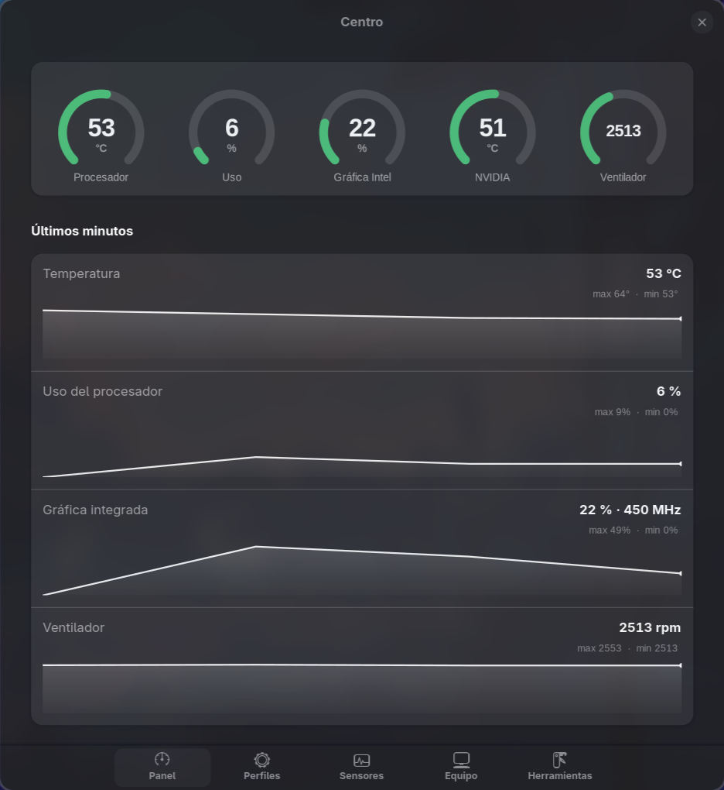
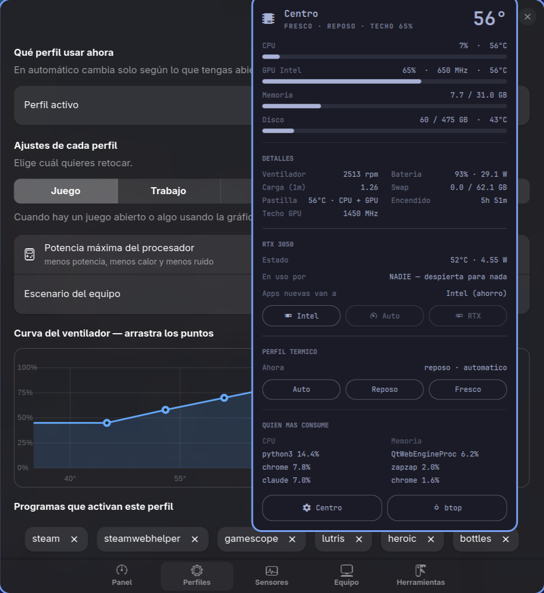
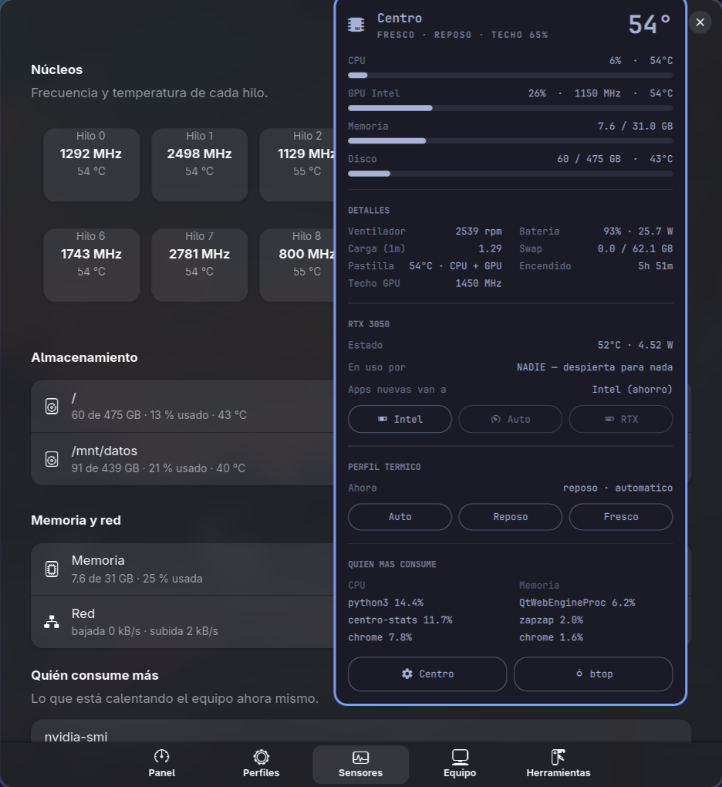
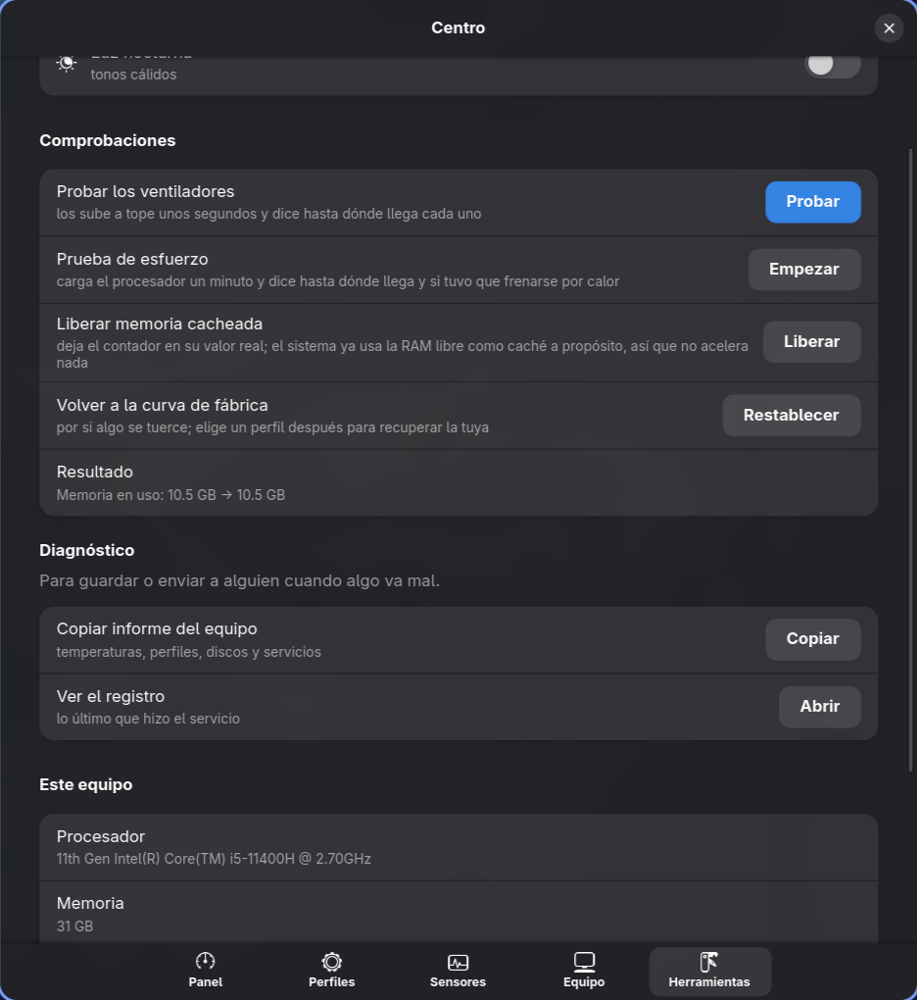
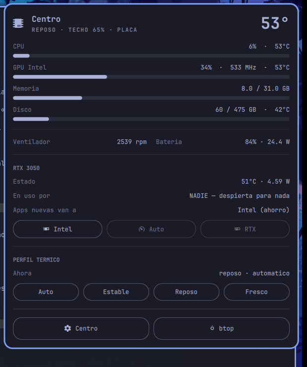

# Centro

Panel de control para portátiles y sobremesas con Linux: temperaturas,
ventiladores, perfiles que cambian solos, batería y privacidad — en una
ventana y en un icono de la barra.

Nació para un MSI GF63, donde MSI Center no existe en Linux, pero **detecta el
hardware en vez de darlo por supuesto**: en un equipo sin controlador
embebido, sin batería o sin gráfica dedicada, esos controles simplemente no
aparecen. Nunca un botón que no hace nada.

> *A control panel for Linux laptops and desktops: temperatures, fan curves,
> automatic power profiles, battery care and privacy toggles. Spanish UI.*



## Qué hace

**Perfiles que cambian solos.** Detecta si estás jugando, trabajando o con el
equipo parado y ajusta el tope del procesador, la curva del ventilador y el
escenario del equipo. Se le dice qué programas cuentan como cada cosa
eligiéndolos de una lista.

| perfil | cuándo | qué hace |
|---|---|---|
| Juego | un juego abierto, o algo usando la gráfica dedicada | tope alto, mucho aire |
| Trabajo | un editor o IDE abierto | equilibrado |
| Estable | a mano | sin bandazos: el ventilador casi no cambia de velocidad |
| Reposo | ni lo uno ni lo otro | tope bajo, el equipo enfría |
| Fresco | a mano | alivio con calor: baja pantalla y apaga el teclado |

**Curva del ventilador que se arrastra.** Los seis puntos se mueven con el
ratón. No se puede guardar una curva inválida: cada punto se mueve solo entre
sus vecinos.



**Enfriado prolongado.** El ventilador sigue soplando después de que baje la
temperatura, porque el disipador sigue caliente. Se ajusta con un rango
*desde / hasta* y un tiempo mínimo.

**Cuidado de la batería.** Límite de carga (cargarla siempre al 100 % la
desgasta antes) y salud real frente a su capacidad original.

**Privacidad.** Apagar la cámara la desconecta de verdad: `/dev/video*`
desaparece del sistema, y el piloto de la tecla se apaga con ella.

**Luz del teclado automática.** Se enciende al caer la tarde y se apaga por la
mañana. Va por horario porque la mayoría de los portátiles no traen sensor de
luz; si el tuyo no tiene teclado retroiluminado, el control no aparece.

**Todos los sensores.** Frecuencia y temperatura de cada hilo, discos con su
temperatura, memoria, red y qué está consumiendo ahora mismo.



**Herramientas.** Prueba de esfuerzo que dice si el procesador se frena por
calor, prueba de ventiladores, informe del equipo al portapapeles, registro.



**Widget de barra** para [Omarchy](https://omarchy.org/): la temperatura de la
pieza más caliente siempre a la vista, y al desplegarlo todo el detalle más los
botones de perfil y de gráfica.

Es **el mismo proyecto**, no dos: la ventana y el widget escriben la misma
configuración y el demonio la aplica, así que cambies donde cambies, lo otro se
entera.



## Cómo está hecho

```
centrod   demonio. LO ÚNICO que corre como root.
centro    la ventana (GTK4 + libadwaita)
fresco    atajo de terminal
hw.py     capa de hardware: todo se detecta, nada se cablea
```

**Ni la ventana ni el widget piden contraseña.** Solo escriben
`~/.config/centro/centro.conf`, un fichero de texto tuyo. El demonio lo lee y
aplica. Toda la escritura privilegiada vive en un sitio.

**No se sondea la gráfica dedicada si está dormida.** El estado sale de
`sysfs`; a `nvidia-smi` solo se le pregunta si ya está despierta. Sondearla en
bucle la mantendría en vela y tiraría abajo su ahorro de energía.

## Instalar

Hace falta `python3`, `python-gobject` y `libadwaita`.

### En Omarchy

```bash
omarchy plugin add https://github.com/jose22072000/linux-hardware-center.git --enable
```

Eso pone el widget en la barra. Para que además funcionen los perfiles y la
curva del ventilador hace falta el servicio, que necesita permisos:

```bash
sudo ~/.config/omarchy/plugins/centro.panel/instalar.sh
```

Son dos pasos a propósito: el widget solo lee, pero cambiar la curva del
ventilador o el tope del procesador se escribe en el controlador del equipo y
eso pide root. Si te quedas en el primer paso, el widget te lo dice en vez de
enseñarte botones que no harían nada.

### En cualquier otro escritorio

```bash
git clone https://github.com/jose22072000/linux-hardware-center.git
cd linux-hardware-center
sudo ./instalar.sh
```

Tendrás la ventana y el servicio; el widget de barra es solo para Omarchy y se
salta solo.

Para quitarlo todo: `sudo ./instalar.sh desinstalar`. Tu configuración se
queda por si vuelves.

## Qué funciona en cada equipo

| | hace falta |
|---|---|
| Temperaturas, uso, discos, red, perfiles | nada: funciona en cualquier Linux |
| Tope del procesador | `intel_pstate` |
| Curva del ventilador, escenario, cámara, tecla Fn | controlador embebido compatible (`msi-ec`) |
| Límite de carga | que la batería exponga `charge_control_end_threshold` |
| Modo de gráfica | equipo híbrido con gráfica dedicada |
| Widget de barra | Omarchy |

En un sobremesa se ve todo lo de arriba salvo batería y controlador embebido.
**El control de ventiladores por `pwm` de `hwmon`, que es lo que usan los
sobremesas, todavía no está**: se ven las temperaturas pero no se gobiernan
los ventiladores.

## Licencia

MIT. Incluye `gpu-mode`, de Dima Panov, también MIT — ver
[TERCEROS.md](TERCEROS.md).

## Ayuda y fallos

Si algo no funciona en tu equipo, **abre un issue** con la salida de
*Herramientas → Copiar informe del equipo*: ahí va el modelo de procesador, los
sensores que detecta y qué controles tiene tu máquina. Con eso se puede añadir
soporte para hardware que no tengo delante.

Lo que más ayuda ahora mismo:

- probarlo en portátiles de otras marcas (Lenovo, ASUS, HP…) y decir qué
  detecta y qué no
- probarlo en un sobremesa: debería enseñar sensores y perfiles, pero todavía
  no gobierna ventiladores por `pwm`
- traducciones: la interfaz está en español y todos los textos están en un
  solo sitio en `bin/centro`
